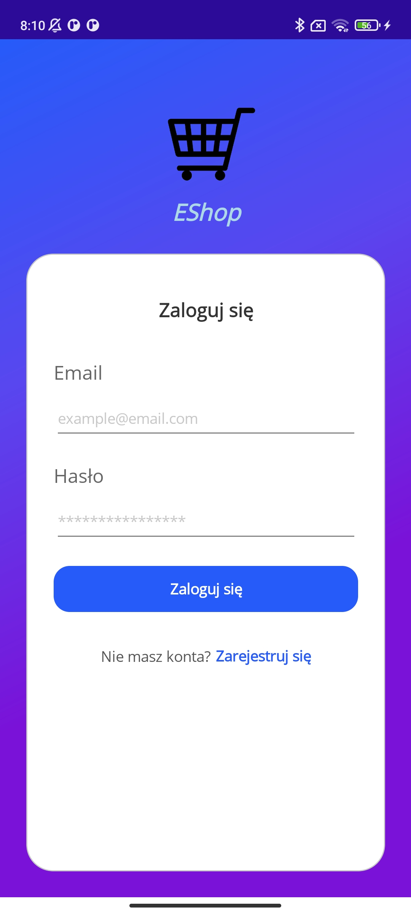
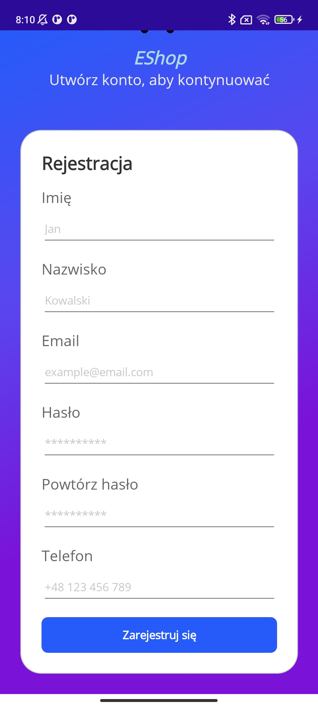
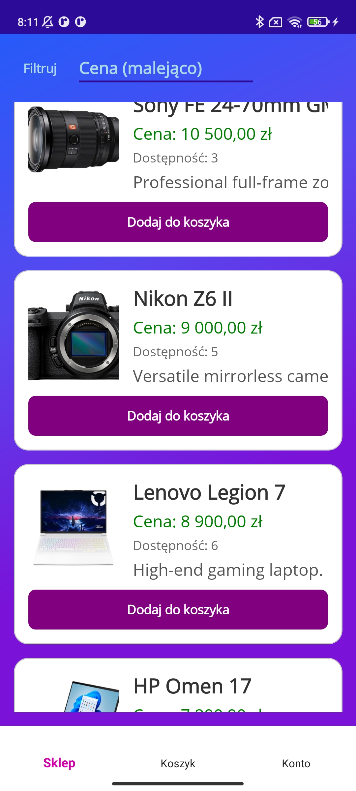
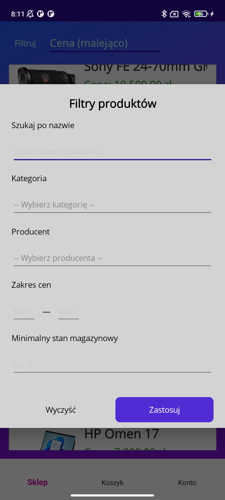
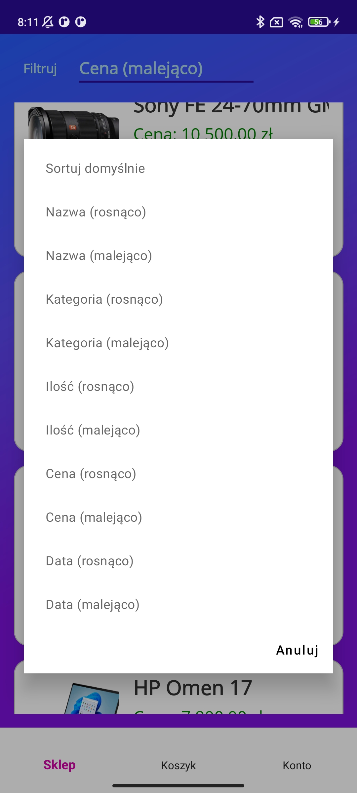
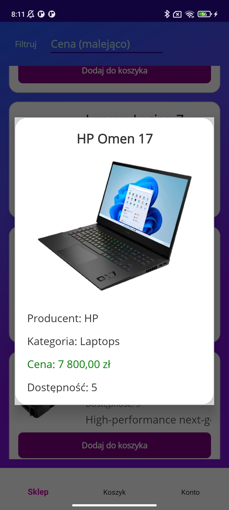
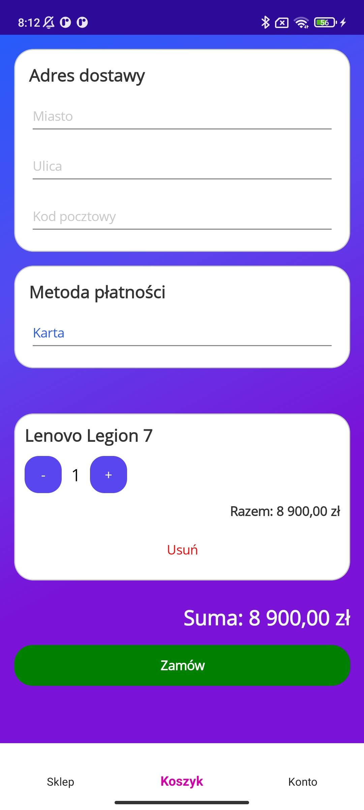
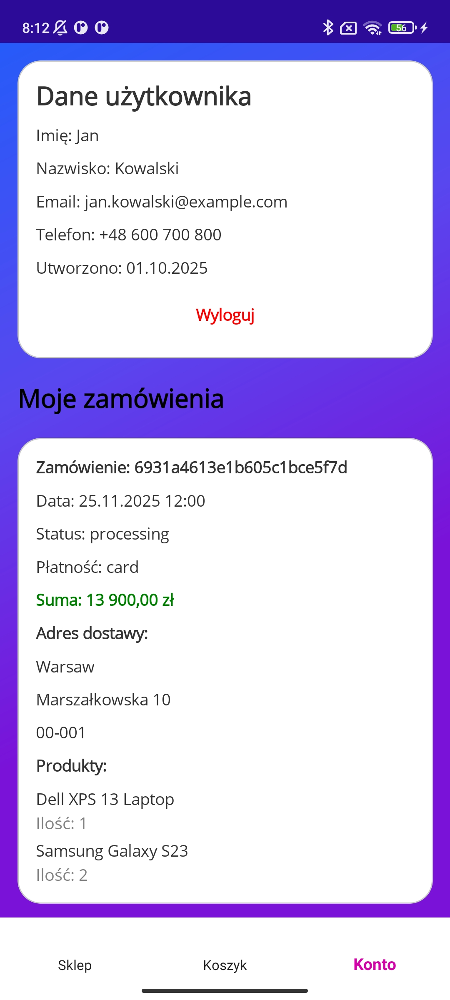

# Dokumentacja Projektu - Sklep Komputerowy

## Spis Treści
1. [Wprowadzenie](#1-wprowadzenie)
2. [Stos Technologiczny](#2-stos-technologiczny)
3. [Architektura Systemu](#3-architektura-systemu)
4. [Baza Danych MongoDB](#4-baza-danych-mongodb)
5. [Biblioteka DLL - Warstwa Logiki](#5-biblioteka-dll---warstwa-logiki)
6. [Testy Jednostkowe](#6-testy-jednostkowe)
7. [Aplikacja MAUI - Interfejs Użytkownika](#7-aplikacja-maui---interfejs-użytkownika)
8. [Docker i Automatyzacja](#8-docker-i-automatyzacja)
9. [Podsumowanie](#9-podsumowanie)

---

## 1. Wprowadzenie

### 1.1 Przedmiot Projektu
Tematyką projektu jest sklep internetowy specjalizujący się w sprzedaży
artykułów elektronicznych. System został zaprojektowany z myślą
o elastycznym zarządzaniu produktami o zróżnicowanych specyfikacjach
technicznych, obsłudze kont użytkowników oraz procesowaniu zamówień. 

### 1.2 Cel Biznesowy
Aplikacja ma umożliwić:
- Przeglądanie i wyszukiwanie produktów z zaawansowanym filtrowaniem
- Zarządzanie kontem użytkownika z systemem uwierzytelniania
- Składanie zamówień z automatyczną kontrolą stanów magazynowych
- Administrację produktami przez uprawnionych użytkowników

---

## 2. Stos Technologiczny

### 2.1 Backend i Logika Biznesowa
- **C# (.NET)** - podstawowy język programowania
- **MongoDB Driver dla .NET** - oficjalny sterownik do komunikacji z bazą danych
- **MongoDB.Bson** - obsługa formatów dokumentów

### 2.2 Baza Danych
- **MongoDB 7.0** - dokumentowa baza danych NoSQL
- **Docker** - konteneryzacja bazy danych
- **JavaScript** - skrypty inicjalizacyjne bazy danych

### 2.3 Przechowywanie Multimediów
- **Cloudinary** - chmurowe rozwiązanie do przechowywania i serwowania zdjęć produktów
- **CloudinaryDotNet** - oficjalna biblioteka .NET do integracji

### 2.4 Interfejs Użytkownika
- **.NET MAUI** - wieloplatformowy framework UI
- **CommunityToolkit.Maui** - zestaw rozszerzeń do .NET MAUI
- **MVVM Pattern** - architektura aplikacji

### 2.5 Testowanie
- **xUnit** - framework do testów jednostkowych


---

## 3. Architektura Systemu

### 3.1 Architektura Warstwowa
Projekt został podzielony na trzy niezależne moduły zgodnie z zasadą separacji odpowiedzialności:

```
┌─────────────────────────────────────┐
│     App (MAUI) - Warstwa GUI        │
│  - ViewModels (MVVM)                │
│  - Views (XAML)                     │
│  - Wrappers                         │
└──────────────┬──────────────────────┘
               │ 
               ▼
┌─────────────────────────────────────┐
│   DLL - Warstwa Logiki Biznesowej   │
│  - Managers (Product, User, Order)  │
│  - Models                           │
│  - Filtry i Sortowanie              │
│  - Komunikacja z MongoDB            │
└──────────────┬──────────────────────┘
               │ 
               ▼
┌─────────────────────────────────────┐
│        MongoDB w Dockerze           │
│  - Kolekcja Products                │
│  - Kolekcja Users                   │
│  - Kolekcja Orders                  │
└─────────────────────────────────────┘

        ┌──────────────────┐
        │  Tests (xUnit)   │ ──► testuje DLL
        └──────────────────┘
```

### 3.2 Moduł DLL (Biblioteka Klas)
**Lokalizacja:** `dll/dll/`

Moduł stanowiący rdzeń aplikacji, zawiera:
- **DataManager** - zarządzanie konfiguracją połączenia
- **MongoDbManager** - inicjalizacja połączenia z bazą danych
- **ShoppingCart** - logika koszyka zakupowego
- **Managers:**
  - `ProductManager` - operacje na produktach
  - `UserManager` - rejestracja i logowanie
  - `OrderManager` - tworzenie i zarządzanie zamówieniami
- **Models:** definicje struktur danych (Product, User, Order)
- **Extensions:** rozszerzenia dla filtrowania i sortowania

### 3.3 Moduł Tests
**Lokalizacja:** `dll/Tests/`

Kompleksowe testy jednostkowe wszystkich metod z biblioteki DLL:
- `ProductManagerTest.cs` - testy produktów
- `OrderManagerTests.cs` - testy zarządzania zamówieniami
- `UserManagerTests.cs` - testy uwierzytelniania
- `ShoppingCartTest.cs` - testy koszyka

### 3.4 Moduł App (MAUI)
**Lokalizacja:** `App/App/App/`

Aplikacja GUI dla urządzeń z systemem operacyjnym ANDROID w architekturze MVVM:
- **ViewModels** - logika prezentacji
- **Views** - interfejs użytkownika (XAML)
- **Wrappers** - wrappery dla modeli DLL
- **Sessions** - zarządzanie sesją użytkownika

---

## 4. Baza Danych MongoDB

### 4.1 Struktura Bazy Danych
Nazwa bazy: **`shop`**

### 4.2 Kolekcja Products

**Opis:** Przechowuje informacje o produktach dostępnych w sklepie.

**Struktura dokumentu:**
```csharp
public class Product
{
    [BsonId]
    [BsonRepresentation(BsonType.ObjectId)]
    public ObjectId Id { get; set; }

    [BsonElement("name")]
    public string Name { get; set; }               // Nazwa produktu

    [BsonElement("manufacturer")]
    public string Manufacturer { get; set; }       // Producent

    [BsonElement("category")]
    public string Category { get; set; }           // Kategoria

    [BsonElement("price")]
    public decimal Price { get; set; }             // Cena

    [BsonElement("stock")]
    public int Stock { get; set; }                 // Stan magazynowy

    [BsonElement("imageUrl")]
    public string ImageUrl { get; set; }           // URL do zdjęcia

    [BsonElement("specs")]
    public Dictionary<string, string> Specs { get; set; }  // Specyfikacje techniczne

    [BsonElement("description")]
    public string Description { get; set; }        // Opis produktu

    [BsonElement("createdAt")]
    public DateTime CreatedAt { get; set; }        // Data dodania
}
```

**Przykładowy dokument w bazie:**
```js
{
    _id: ObjectId('6931a62442ebb44d99ce5f49'),
    name: "PlayStation 5",
    manufacturer: "Sony",
    category: "Consoles",
    price: Decimal128('2900'),
    stock: 5,
    imageUrl: "https://res.cloudinary.com/dv1nk0kbi/image/upload/v1764870539/10808d3f-bd2e-4e76-a090-c0f2989a61c5.png",
    specs: { Storage: "1TB SSD", GPU: "RDNA 2", RAM: "16GB GDDR6" },
    description: "Next-generation console with ray tracing support and fast SSD storage.",
    createdAt: ISODate('2025-11-23T12:00:00.000Z')
  }
```

**Decyzje projektowe:**
- **użycie imageUrl** - przechowywanie URL zamiast binarnych danych zdjęć znacząco optymalizuje wydajność bazy i zmniejsza rozmiar dokumentów
- **Dictionary<string, string> Specs** - elastyczna struktura pozwalająca na różne specyfikacje dla różnych kategorii produktów (np. CPU ma inne parametry niż monitor)

### 4.3 Kolekcja Users

**Opis:** Zarządza kontami użytkowników i uwierzytelnianiem.

**Struktura dokumentu:**
```csharp
public class User
{
    [BsonId]
    [BsonRepresentation(BsonType.ObjectId)]
    public ObjectId Id { get; set; }

    [BsonElement("firstName")]
    public string FirstName { get; set; }          // Imię

    [BsonElement("lastName")]
    public string LastName { get; set; }           // Nazwisko

    [BsonElement("email")]
    public string Email { get; set; }              // Email (unikalny)

    [BsonElement("role")]
    public string Role { get; set; }               // Rola (customer/admin)

    [BsonElement("password")]
    public string Password { get; set; }           // Hasło

    [BsonElement("phoneNumber")]
    public string PhoneNumber { get; set; }        // Numer telefonu

    [BsonElement("createdAt")]
    public DateTime CreatedAt { get; set; }        // Data rejestracji
}
```

**Walidacja haseł:**
- Minimalna długość: 8 znaków
- Wymagana wielka litera
- Wymagana mała litera
- Wymagana cyfra
- Wymagany znak specjalny

**Walidacja emaila:** Regex: `^([\w\.\-]+)@([\w\-]+)((\.(\w){2,3})+)$`
Wyrażenie regularne sprawdza, czy adres e-mail ma poprawny format: 
- część przed @ składa się z liter, cyfr, kropek i myślników
- część po @ składa się z nazwy domeny kończącej się rozszerzeniemtypu .pl lub.com

### 4.4 Kolekcja Orders

**Opis:** Rejestruje wszystkie zamówienia złożone przez użytkowników.

**Struktura dokumentu:**
```csharp
public class Order
{
    [BsonId]
    [BsonRepresentation(BsonType.ObjectId)]
    public ObjectId Id { get; set; }

    [BsonElement("customerId")]
    [BsonRepresentation(BsonType.ObjectId)]
    public ObjectId CustomerId { get; set; }       // Referencja do User

    [BsonElement("items")]
    public List<OrderItem> Items { get; set; }     // Lista produktów

    [BsonElement("status")]
    public string Status { get; set; }             // Status zamówienia

    [BsonElement("createdAt")]
    public DateTime CreatedAt { get; set; }        // Data złożenia

    [BsonElement("totalAmount")]
    public decimal TotalAmount { get; set; }       // Całkowita kwota

    [BsonElement("deliveryAddress")]
    public DeliveryAddress DeliveryAddress { get; set; }  // Adres dostawy

    [BsonElement("paymentMethod")]
    public string PaymentMethod { get; set; }      // Metoda płatności
}

public class OrderItem
{
    [BsonElement("productId")]
    [BsonRepresentation(BsonType.ObjectId)]
    public ObjectId ProductId { get; set; }        // Referencja do Product

    [BsonElement("quantity")]
    public int Quantity { get; set; }              // Ilość
}

public class DeliveryAddress
{
    [BsonElement("city")]
    public string City { get; set; }

    [BsonElement("street")]
    public string Street { get; set; }

    [BsonElement("postalCode")]
    public string PostalCode { get; set; }
}
```

**Relacje:**
- `customerId` łączy zamówienie z kontem użytkownika
- `OrderItem.productId` łączy pozycję zamówienia z konkretnym produktem
- Dokumentowa natura bazy pozwala na zagnieżdżenie `items` i `deliveryAddress` bezpośrednio w zamówieniu

---

## 5. Biblioteka DLL - Warstwa Logiki

* ProductManager
    * Dodawanie produktu z automatycznym uploadem zdjęcia
    * Walidacja danych produktu
    * Pobieranie produktu po ID
    * Usuwanie produktu (tylko admin)
    * Pobieranie unikalnych producentów
* ProductFilter
    * Filtrowanie produktów
* ProductSort
    * Sortowanie produktów
* UserManager
    * Rejestracja
    * Walidacja hasła
    * Logowanie
* OrderManager
    * Tworzenie zamówienia
    * Pobieranie zamówień użytkownika
    * Aktualizacja statusu zamówienia
* ShoppingCart
    * Dodawanie produktu do koszyka
    * Automatyczna aktualizacja stanów magazynowych


Zalety:
* Centralizacja konfiguracji umożliwia łatwą zmianę parametrów połaczenia
* Możliwość łączenia fitrów
* Czytelny kod
* Łatwość testowania

---

## 6. Testy Jednostkowe

### 6.1 Framework i Struktura
Wykorzystano **xUnit** do kompleksowego testowania wszystkich metod biblioteki DLL.

**Statystyki testów:**
- `ProductManagerTest.cs`
- `OrderManagerTests.cs`
- `UserManagerTests.cs`
- `ShoppingCartTest.cs`
- `OrderListExtensionTest.cs`

### 6.2 Pokrycie Testami
Testy zapewniają:
- Weryfikację poprawności operacji
- Testowanie przypadków brzegowych
- Walidację danych wejściowych
- Sprawdzanie obsługi błędów
- Testowanie filtrów i sortowania

---

## 7. Aplikacja MAUI - Interfejs Użytkownika

# 7.1 Struktura GUI

* Views
    * Popups
        * ProductFilterPopup
        * ProductPopup
    * AccountPage
    * LoginPage
    * MainPage
    * RegisterPage
    * ShoppingCartPage
* ViewModels
    * BaseViewModel - klasa implementująca INotifyPropertyChanged
    * RelayCommand - klasa implementująca ICommand
    * AccountViewModel
    * LoginViewModel
    * MainViewModel
    * RegisterViewModel
    * ShoppingCartViewModel
* Wrappers
    * CartItem
    * OrderVM
* Sessionss
    * Session
* App
* AppShell

# 7.2 Screenshoty Aplikacji

<br>


**Logowanie**

<br>


**Rejestracji**

<br>


**Ekran główny aplikacji**

<br>


**Filtrowania**

<br>


**Sortowania**

<br>


**Detale produktu**

<br>


**Koszyk zakupowy**

<br>


**Konto użytkownika**

## 8. Docker i Automatyzacja

### 8.1 Docker Compose

**docker-compose.yml:**
```yaml
services:
  mongo:
    image: mongo:latest # uruchamianie kontenera na podstawie najnowszego oficjalnego obrazu
    container_name: projectShop # nadanie kontenerowi konkretnej nazwy
    restart: unless-stopped # uruchomienie kontenera ponownie przy restarcie Dockera
    ports:
      - "1500:27017" #  niestandardowy port (zamiast domyślnego 27017) unika konfliktów
    environment: # zmienne środowiskowe MongoDB, tworzą konto admina i wskazują domyślną bazę danych
      MONGO_INITDB_ROOT_USERNAME: root
      MONGO_INITDB_ROOT_PASSWORD: password
      MONGO_INITDB_DATABASE: shop
    volumes:
      - mongo-data:/data/db # dane zachowywane między restartami kontenera
      - ./initdb:/docker-entrypoint-initdb.d:ro # wykonanie plików .js i .json w pliku ./initdb przy pierwszym uruchomieniu

volumes:
  mongo-data: # definicja wolumenu Dockera
```

### 8.2 Skrypt Inicjalizacyjny

**initCollections.js:**
```javascript
  // przełączenie na bazę shop
db = db.getSiblingDB('shop');

// Tworzenie kolekcji
db.createCollection('users');
db.createCollection('orders');
db.createCollection('products');

// Odczyt pliów JSON
const fs = require('fs');

function readJSON(path) {
    return JSON.parse(fs.readFileSync(path, 'utf8'));
}

// Wczytanie danych
const products = readJSON('/docker-entrypoint-initdb.d/Products.json');
const users    = readJSON('/docker-entrypoint-initdb.d/Users.json');
const orders   = readJSON('/docker-entrypoint-initdb.d/Orders.json');

// Konwersja typów
users.forEach(u => {
    u._id = ObjectId(u._id);
    u.createdAt = new Date(u.createdAt);
});

products.forEach(p => {
    p._id = ObjectId(p._id);
    p.createdAt = new Date(p.createdAt);
    p.price = NumberDecimal(p.price.toString());
});

orders.forEach(o => {
    o._id = ObjectId(o._id);
    o.customerId = ObjectId(o.customerId);
    o.createdAt = new Date(o.createdAt);
    o.items.forEach(i => i.productId = ObjectId(i.productId));
    
    if (o.totalAmount !== undefined && o.totalAmount !== null) {
        const amountString = 
            typeof o.totalAmount === "object" && o.totalAmount.$numberDecimal
                ? o.totalAmount.$numberDecimal
                : o.totalAmount.toString();
        o.totalAmount = NumberDecimal(amountString);
    }
});

// Wstawienie danych do kolekcji
db.products.insertMany(products);
db.users.insertMany(users);
db.orders.insertMany(orders);

// Potwierdzenie wykonania skryptu w konsoli Dockera
print("Database seeded successfully!");
```


### 8.3 Zalety Automatyzacji

 **Reprodukowalność** - każdy developer może uruchomić identyczne środowisko  
 **Szybkość** - baza gotowa w kilkadziesiąt sekund  
 **Spójność danych** - dane testowe zawsze takie same  
 **Brak konfiguracji manualnej** - zero ręcznych kroków w MongoDB  
 **Łatwość resetowania** - `docker-compose down -v && docker-compose up -d`

---

## 9. Podsumowanie


 **Funkcjonalny sklep internetowy** z pełnym procesem zakupowym  
 **Architektura warstwowa** - separacja GUI, logiki biznesowej i danych  
 **Dokumentowa baza danych** - elastyczna struktura dla różnych produktów  
 **Automatyzacja** - Docker + skrypty inicjalizacyjne  
 **Testy jednostkowe** - gwarancja, że metody działają z naszymi przewidywaniami    
 **Cloudinary** - zarządzanie multimediami, żeby nie przechowywać ich w bazie danych  
 **MAUI** - interfejs użytkownika   

## Bezpieczeństwo

**Zaimplementowano:**
- Dostęp do bazy danych zabezpieczony loginem i hasłem
- Walidacja danych wejściowych
- Walidacja hasła (długość, znaki specjalne)
- Walidacja email (regex)

## Wnioski

Projekt pokazuje, że **MongoDB** jest dobrym wyborem dla systemów e-commerce z elastycznym katalogiem produktów. Dokumentowa natura bazy pozwala na przechowywanie produktów o różnych specyfikacjach bez konieczności modyfikacji schematu.

**Docker** znacząco upraszcza deployment i zapewnia spójność środowisk developerskich, co było kluczowe dla zespołowego developmentu.

Wykorzystanie **Cloudinary** dla multimediów - odciąża bazę danych i przyspieszyła ładowanie aplikacji.

**Architektura warstwowa** (DLL/Tests/App) zapewniła separację odpowiedzialności i ułatwiła testowanie oraz dalszy rozwój aplikacji.

---

### A. Instrukcja instalacji

```bash
# 1. Klonowanie repozytorium
git clone <repository-url>
cd <Nazwa folderu - repozytorium>

# 2. Uruchomienie bazy danych
cd database
docker compose up -d --> utworzenie kontenera

# 3. Uruchomienie i wejście do bazy danych
docker compose start --> uruchomienie kontenera (opcja 1)
docker start projectShop --> uruchomienie kontenera (opcja 2)
docker exec -it projectShop mongosh -u root -p password --> wejście do bazy danych

```

### B. Connection String

```csharp
# plik App.xaml.cs (App)
# należy ustawić adres IP swojego komputera, jeśli pracuje się na urządzeniu fizycznym podłączonym do komputera lub zakomentować to, jeśli używa się emulatora
private void ChangeConnectionString()
{
    string ip = "192.168.1.73";
    DataManager.SetConnectionString($"mongodb://root:password@{ip}:1500/?authSource=admin");
}
```

### C. Kluczowe Zależności (NuGet)

**DLL projekt:**
- MongoDB.Driver 3.5.2
- CloudinaryDotNet 1.27.9

**Tests projekt:**
- coverlet.collector 6.0.0
- Microsoft.Net.Test.Sdk 17.8.0
- xunit 2.5.3
- xunit.runner.visualstudio 2.5.3

**App projekt:**
- CommunityToolkit.Maui 8.0.0
- Microsoft.Maui.Controls 
- Microsoft.Maui.Controls.Compatibility
- Microsoft.Extensions.Logging.Debug

---

## Załączniki

* https://learn.microsoft.com/en-us/dotnet/csharp/
* https://learn.microsoft.com/en-us/dotnet/maui/
* https://www.mongodb.com/docs/
* https://www.mongodb.com/docs/drivers/csharp/current/
* https://cloudinary.com/documentation/dotnet_quickstart
* https://xunit.net/docs/getting-started/v2/getting-started

**Data utworzenia dokumentacji:** Grudzień 2025  
**Autorzy:** [Kacper Szulc oraz Michał Gołaszewski]


